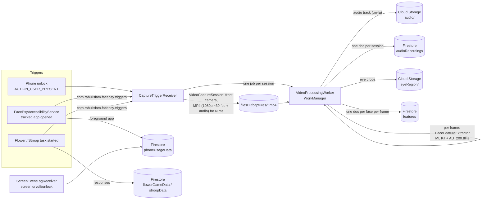
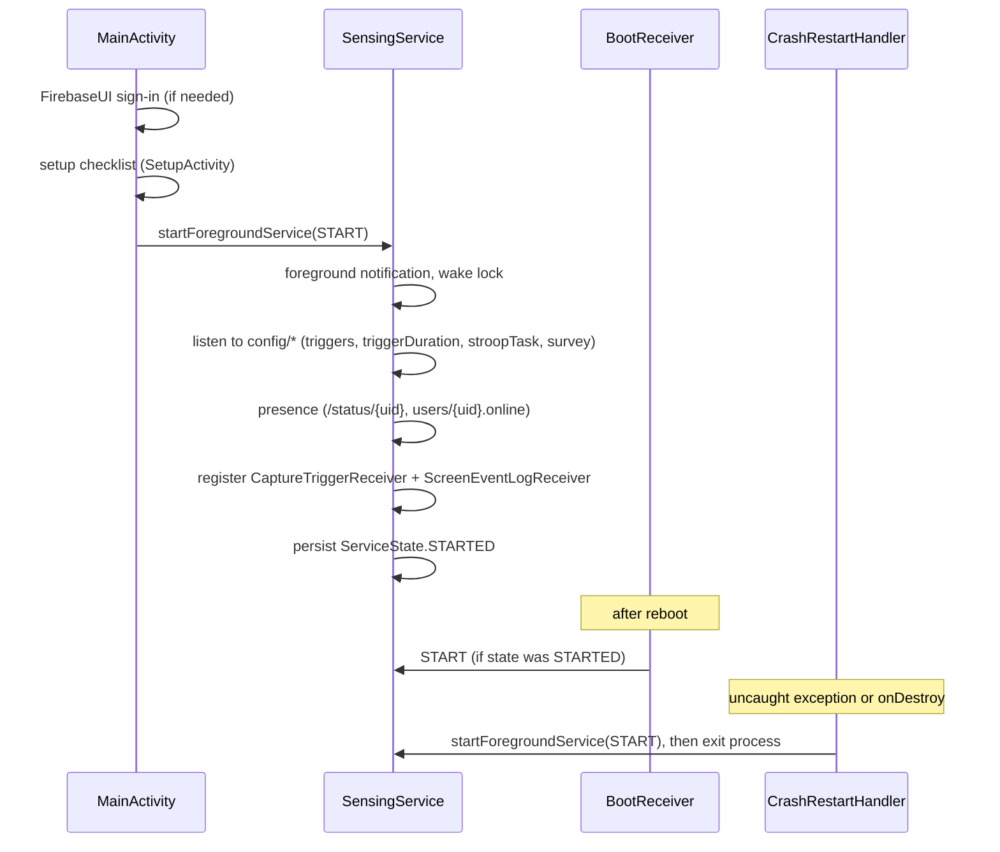

# Architecture

FacePsy is a single Android app (`:app`). Every record goes to Firebase. See
[data-schema.md](data-schema.md) for the stored fields.

## Data flow



1. **Trigger.** A capture session starts when:
   - the phone is unlocked, for `config/triggerDuration.unlockEvent` ms;
   - an app listed in `config/triggers.apps` comes to the foreground, for `.app` ms;
   - a cognitive task starts, for `.flowerGame` / `.stroopTask` ms.

   Only one session runs at a time (`CaptureTriggerReceiver.isCapturing`).
2. **Record.** `capture/VideoCaptureSession` (CameraX 1.4 `VideoCapture`, no preview,
   its own `LifecycleOwner`) records the front camera at 1080p (falling back as low as
   SD), about 30 fps, into app-private storage:
   `filesDir/captures/{yyyy-MM-dd-HH-mm-ss-SSS}{triggerName}.mp4`. Audio is included when
   the microphone permission is granted. No DCIM folder or storage permission is used.
   When the file is finalized, `CaptureTriggerReceiver` enqueues one
   `VideoProcessingWorker` (requires network; exponential backoff from 30 s; up to 5
   attempts).
3. **Audio.** The worker copies the audio track into an `.m4a` without re-encoding,
   uploads it to Storage `audio/{uid}/{session}.m4a` and writes
   `audioRecordings/{uid}_{session}`.
4. **Frames.** The worker decodes every `FRAME_STEP`-th frame (`1` = every frame) in
   chunks of 5 and runs `processing/FaceFeatureExtractor` on each. For every face it:
   - runs `assets/AU_200.tflite` (LiteRT) on a 200x200 grayscale face crop to estimate
     12 FACS action units;
   - uploads left/right eye crops to Storage `eyeRegion/`;
   - writes one `features` document (batched writes, deterministic ids).
5. **Clean up.** The video is deleted. Progress is saved after each chunk (`.progress`)
   and after the audio upload (`.audio-done`), so a stopped or retried worker resumes
   without duplicating uploads or documents.

`FaceFeatureExtractor` is also used by `ImageProcessingWorker`, which is kept only to
process photo jobs that were still queued when a participant updated from the older
photo-based version. The extractor loads ML Kit and the AU model once per worker run.

**Cost.** With `FRAME_STEP = 1`, a 59.9 s session (1,787 frames) took about 11.5 minutes
to process on a Pixel 10, and Firestore writes and eye-crop uploads are about 3x the old
10 fps photo pipeline. `FRAME_STEP = 3` analyses ~10 fps (the old rate) at roughly a
third of the cost. See [known-issues.md](known-issues.md).

## Service lifecycle



- `SensingService` returns `START_STICKY` and stores its state with `ServiceStateStore`,
  so `BootReceiver` can bring it back after a reboot. When Android restarts it with a
  null intent after the process dies, it sets everything up again, as for `START`.
- `FacePsyApplication` creates the shared NTP clock (`SensingService.kronosClock`)
  before any component runs. The accessibility service is bound right after boot,
  possibly before `SensingService` starts, and it needs the clock.
- `CrashRestartHandler` is installed as the default uncaught-exception handler by
  `MainActivity` and `SensingService`. On a crash, and whenever the service is
  destroyed, it restarts the service and exits the process with code 2.
- `SensingService` exposes the live config through companion fields
  (`appTrackingList`, `triggerDuration`, `stroopConfig`, `surveyConfig`) and the shared
  `kronosClock`. These are read by the receivers, the accessibility service and the
  task activities.
- `FacePsyMessagingService` shows FCM push notifications, such as survey reminders,
  and opens `MainActivity` when tapped.

## Participant setup and permissions

`ui/SetupActivity` is a single checklist (built from `setup/SetupStep`) that explains
each permission, shows whether it is on, and opens the right system screen for it.
Camera, microphone and accessibility are required; notifications, unrestricted battery
use and "keep permissions if unused" (Android 11+, shown only when it applies) are
recommended. The microphone step tells participants that audio, including nearby
voices, is uploaded.

- `MainActivity` opens it after sign-in until onboarding is completed, then again on any
  visit while a required step is missing, and at most once a day for missing
  recommended steps.
- `setup/SetupMonitor.check` runs every minute (from `SensingService`), on every unlock
  and whenever the home screen resumes. It logs `SETUP_<step>_OK/_MISSING` changes to
  `phoneUsageData` and, while a required step is missing, shows one notification that
  opens the checklist. It never changes a setting itself.
- A force stop turns the accessibility service off, and a revoked runtime permission
  kills the process; in both cases the participant is asked again through this flow.

## Package map

```
com.rahulislam.facepsy
├── FacePsyApplication             creates the shared NTP clock at process start
├── MainActivity                  launcher: sign-in, starts service, opens setup, home buttons
├── FacePsyAccessibilityService   foreground-app logging + app-open capture trigger
├── capture/
│   └── VideoCaptureSession       records one front-camera MP4 (video + audio) with CameraX
├── data/
│   ├── FirebaseRefs              Firestore/RTDB/Storage names (data contract)
│   └── TriggerContract           capture-trigger broadcast action, extras, duration keys
├── service/
│   ├── SensingService            foreground service: config, presence, receivers
│   ├── ServiceAction             START / STOP intent actions
│   ├── ServiceStateStore         persisted STARTED / STOPPED state
│   └── CrashRestartHandler       uncaught-exception handler that restarts the service
├── receiver/
│   ├── CaptureTriggerReceiver    starts a video session, queues processing
│   ├── ScreenEventLogReceiver    logs screen on/off/unlock
│   └── BootReceiver              restarts the service after boot
├── setup/
│   ├── SetupStep                 checklist items: camera, microphone, accessibility, ...
│   └── SetupMonitor              re-checks setup, logs changes, reminder notification
├── processing/
│   ├── VideoProcessingWorker     audio upload + per-frame feature extraction of a session
│   ├── FaceFeatureExtractor      ML Kit + AU model + eye crops for one image/frame
│   └── ImageProcessingWorker     legacy: drains photo jobs queued before the update
├── messaging/
│   └── FacePsyMessagingService   FCM notifications
├── tasks/
│   ├── flower/                   visual-spatial memory game (3x3 and 4x4 grids)
│   └── stroop/                   Stroop color-word task
├── ui/
│   ├── SetupActivity             onboarding / setup checklist
│   └── InstructionActivity       participant instructions
└── util/                         permission helpers, service logging
```
