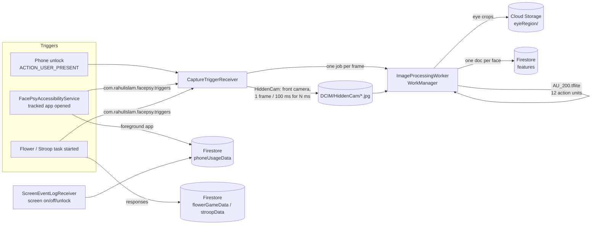
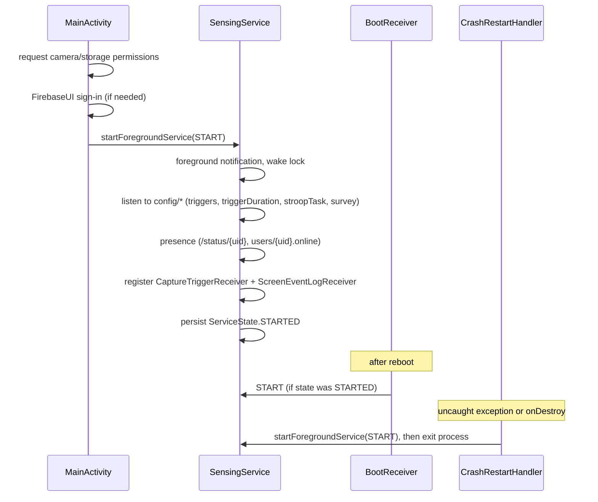

# Architecture

FacePsy is a single Android app (`:app`) plus a vendored camera library (`:library`,
a copy of [CottaCush/HiddenCam](https://github.com/CottaCush/HiddenCam)). Every
record goes to Firebase. See [data-schema.md](data-schema.md) for the stored fields.

## Data flow



1. **Trigger.** A capture session starts when:
   - the phone is unlocked, for `config/triggerDuration.unlockEvent` ms;
   - an app listed in `config/triggers.apps` comes to the foreground, for `.app` ms;
   - a cognitive task starts, for `.flowerGame` / `.stroopTask` ms.

   Only one session runs at a time (`CaptureTriggerReceiver.isCapturing`).
2. **Capture.** `HiddenCam` (CameraX, no preview) writes a 1080x1920 front-camera
   frame every 100 ms to `DCIM/HiddenCam`. For each frame,
   `CaptureTriggerReceiver.onImageCaptured` enqueues an `ImageProcessingWorker` with the
   file path, a Kronos timestamp, the session `seq_id`, `gameId` and the trigger name.
3. **Extract.** `ImageProcessingWorker` runs ML Kit face detection (landmarks, contours,
   classification, head pose). For each face it then:
   - builds a 200x200 grayscale face crop and runs `assets/AU_200.tflite` to estimate
     12 FACS action units;
   - crops both eyes from the color frame.
4. **Upload.** The eye crops go to Cloud Storage, and one `features` document per face
   goes to Firestore. The local frame is then deleted.

## Service lifecycle



- `SensingService` returns `START_STICKY` and stores its state with `ServiceStateStore`,
  so `BootReceiver` can bring it back after a reboot. When Android restarts it with a
  null intent after the process dies, it sets everything up again, as for `START`.
- `FacePsyApplication` creates the shared NTP clock (`SensingService.kronosClock`)
  before any component runs. The accessibility service is bound right after boot,
  possibly before `SensingService` starts, and it needs the clock.
- `CrashRestartHandler` is installed as the default uncaught-exception handler by
  `MainActivity` and `SensingService`. On a crash, and whenever the service is
  destroyed, it restarts the service and exits the process with code 2.
- `SensingService` exposes the live config through companion fields
  (`appTrackingList`, `triggerDuration`, `stroopConfig`, `surveyConfig`) and the shared
  `kronosClock`. These are read by the receivers, the accessibility service and the
  task activities.
- `FacePsyMessagingService` shows FCM push notifications, such as survey reminders,
  and opens `MainActivity` when tapped.

## Participant setup and permissions

`ui/SetupActivity` is a single checklist (built from `setup/SetupStep`) that explains
each permission, shows whether it is on, and opens the right system screen for it.
Camera/storage and accessibility are required; notifications, unrestricted battery use
and "keep permissions if unused" (Android 11+) are recommended.

- `MainActivity` opens it after sign-in until onboarding is completed, then again on any
  visit while a required step is missing, and at most once a day for missing
  recommended steps.
- `setup/SetupMonitor.check` runs every minute (from `SensingService`), on every unlock
  and whenever the home screen resumes. It logs `SETUP_<step>_OK/_MISSING` changes to
  `phoneUsageData` and, while a required step is missing, shows one notification that
  opens the checklist. It never changes a setting itself.
- A force stop turns the accessibility service off, and a revoked runtime permission
  kills the process; in both cases the participant is asked again through this flow.

## Package map

```
com.rahulislam.facepsy
├── FacePsyApplication             creates the shared NTP clock at process start
├── MainActivity                  launcher: permissions, sign-in, starts service, home buttons
├── FacePsyAccessibilityService   foreground-app logging + app-open capture trigger
├── data/
│   ├── FirebaseRefs              Firestore/RTDB/Storage names (data contract)
│   └── TriggerContract           capture-trigger broadcast action, extras, duration keys
├── service/
│   ├── SensingService            foreground service: config, presence, receivers
│   ├── ServiceAction             START / STOP intent actions
│   ├── ServiceStateStore         persisted STARTED / STOPPED state
│   └── CrashRestartHandler       uncaught-exception handler that restarts the service
├── receiver/
│   ├── CaptureTriggerReceiver    runs a HiddenCam capture session, queues extraction
│   ├── ScreenEventLogReceiver    logs screen on/off/unlock
│   └── BootReceiver              restarts the service after boot
├── setup/
│   ├── SetupStep                 checklist items: camera/storage, accessibility, notifications, ...
│   └── SetupMonitor              re-checks setup, logs changes, reminder notification
├── processing/
│   └── ImageProcessingWorker     ML Kit + TFLite feature extraction and upload
├── messaging/
│   └── FacePsyMessagingService   FCM notifications
├── tasks/
│   ├── flower/                   visual-spatial memory game (3x3 and 4x4 grids)
│   └── stroop/                   Stroop color-word task
├── ui/
│   ├── SetupActivity             onboarding / setup checklist
│   └── InstructionActivity       participant instructions
└── util/                         permission helpers, service logging
```
